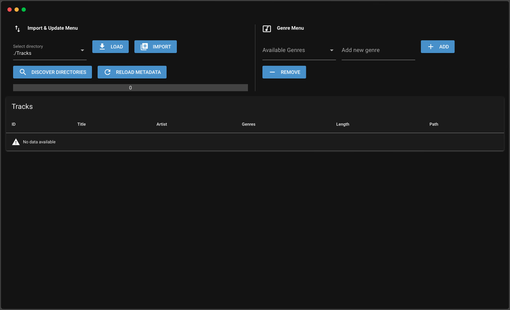

# Music Library

> A library with webinterface for managing audio tracks.

## Table of Contents

* [Introduction](#introduction)
* [Features](#features)
* [Screenshots](#screenshots)
* [Dependencies](#dependencies)
* [Setup](#setup)
* [Usage](#usage)
* [Acknowledgements](#acknowledgements)

## Introduction

- This library manages any type of audio tracks and its metadata.
- Everything is controlled with a webinterface.
- Additional settings can be changed in the `settings.ini` file.

## Features

- Display of important metadata (title, artist, genres, length, ...)
- Sort by metadata
- Preview listen of tracks

## Screenshots

*Webinterface*

## Dependencies

- eyed3
- colorama
- nicegui
- sqlalchemy

## Setup

Use `pip install -r requirements.txt` to install all necessary dependencies.

## Usage

- Use `python main.py` to start the webapp.
- Access the webinterface via `http://localhost:8080` or `http://127.0.0.1:8080`.
- Follow along the screenshots.

## To-Do

- Proper database
- Handle missing files
- Enable genre modification
- Preview listening

## Acknowledgements

This project was inspired by myself, since there was no alternative.

*Original idea in September 2023*
